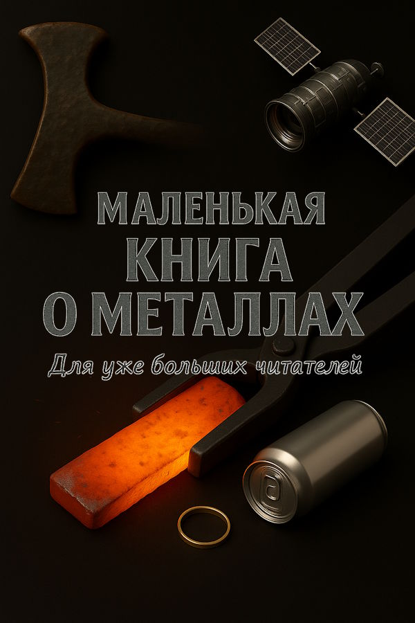

<!-- Hero Section -->

  

    

      <h1 class="hero-title">Удивительный мир металлов</h1>
      
Интерактивная книга для подростков о металлах и металлургии

      
Добро пожаловать в увлекательное путешествие по миру металлов! Узнайте об истории металлургии, свойствах различных металлов, их применении в современном мире и профессиях будущего.

      

        <a href="#contents" class="btn btn-primary">Начать читать</a>
        <a href="./часть_1_история/глава_01_введение.html" class="btn btn-secondary">Первая глава</a>
      

    

    

      
    

  

<!-- Quick Stats -->

  

    
5

    
Частей

  

  

    
42

    
Главы

  

  

    
18

    
Металлов

  

<!-- Table of Contents -->

  <h2 class="section-title">Содержание книги</h2>
  
Изучите мир металлов от истории до современных применений

  

<!-- Часть 1: История металлургии -->

  
1

  

    <h3 class="part-title">История металлургии</h3>
    
Путешествие от каменного века до наших дней — как человечество открывало и осваивало металлы.

    

      <a href="{{ '/часть_1_история/глава_01_введение.html' | relative_url }}" class="chapter-link">1. Введение: Мир металлов вокруг нас</a>
      <a href="{{ '/часть_1_история/глава_02_каменный_век.html' | relative_url }}" class="chapter-link">2. Каменный век и первые металлы</a>
      <a href="{{ '/часть_1_история/глава_03_бронзовый_век.html' | relative_url }}" class="chapter-link">3. Бронзовый век: революция сплавов</a>
      <a href="{{ '/часть_1_история/глава_04_железный_век.html' | relative_url }}" class="chapter-link">4. Железный век: эпоха стали</a>
      <a href="{{ '/часть_1_история/глава_05_средневековье.html' | relative_url }}" class="chapter-link">5. Средневековье: кузнецы и алхимики</a>
      <a href="{{ '/часть_1_история/глава_06_промышленная_революция.html' | relative_url }}" class="chapter-link">6. Промышленная революция</a>
      <a href="{{ '/часть_1_история/глава_07_XX_век.html' | relative_url }}" class="chapter-link">7. XX век: новые металлы</a>
      <a href="{{ '/часть_1_история/глава_08_современность.html' | relative_url }}" class="chapter-link">8. Современность: нанотехнологии</a>
    

    <a href="{{ '/часть_1_история/' | relative_url }}" class="part-explore">Изучить раздел →</a>
  

<!-- Часть 2: Основы металлургии -->

  
2

  

    <h3 class="part-title">Основы металлургии</h3>
    
Научные основы: что такое металл, как они устроены, как их добывают и что такое сплавы.

    

      <a href="{{ '/часть_2_основы/глава_09_что_такое_металл.html' | relative_url }}" class="chapter-link">9. Что такое металл? Строение и свойства</a>
      <a href="{{ '/часть_2_основы/глава_10_периодическая_таблица.html' | relative_url }}" class="chapter-link">10. Периодическая таблица и металлы</a>
      <a href="{{ '/часть_2_основы/глава_11_добыча_руды.html' | relative_url }}" class="chapter-link">11. Как добывают металлы из руды</a>
      <a href="{{ '/часть_2_основы/глава_12_сплавы.html' | relative_url }}" class="chapter-link">12. Сплавы: когда металлы объединяются</a>
    

    <a href="{{ '/часть_2_основы/' | relative_url }}" class="part-explore">Изучить раздел →</a>
  

<!-- Часть 3: Галерея металлов -->

  
3

  

    <h3 class="part-title">Галерея металлов</h3>
    
Подробные портреты важнейших металлов — от золота до урана.

    

      <a href="{{ '/часть_3_металлы/глава_13_золото.html' | relative_url }}" class="chapter-link">13. Золото: металл фараонов и пиратов</a>
      <a href="{{ '/часть_3_металлы/глава_14_серебро.html' | relative_url }}" class="chapter-link">14. Серебро: лунный металл</a>
      <a href="{{ '/часть_3_металлы/глава_15_платина.html' | relative_url }}" class="chapter-link">15. Платина: благородный и редкий</a>
      <a href="{{ '/часть_3_металлы/глава_17_железо.html' | relative_url }}" class="chapter-link">17. Железо: основа цивилизации</a>
      <a href="{{ '/часть_3_металлы/глава_19_алюминий.html' | relative_url }}" class="chapter-link">19. Алюминий: металл будущего</a>
      
и еще 13 металлов...

    

    <a href="{{ '/часть_3_металлы/' | relative_url }}" class="part-explore">Изучить раздел →</a>
  

<!-- Часть 4: Металлы вокруг нас -->

  
4

  

    <h3 class="part-title">Металлы вокруг нас</h3>
    
Как металлы используются в компьютерах, автомобилях, космосе, медицине и других областях.

    

      <a href="{{ '/часть_4_применения/глава_31_компьютеры.html' | relative_url }}" class="chapter-link">31. Металлы в компьютерах и смартфонах</a>
      <a href="{{ '/часть_4_применения/глава_32_автомобили.html' | relative_url }}" class="chapter-link">32. Автомобильная промышленность</a>
      <a href="{{ '/часть_4_применения/глава_33_космос.html' | relative_url }}" class="chapter-link">33. Космические технологии</a>
      <a href="{{ '/часть_4_применения/глава_34_медицина.html' | relative_url }}" class="chapter-link">34. Медицина и металлы</a>
      <a href="{{ '/часть_4_применения/глава_35_экология.html' | relative_url }}" class="chapter-link">35. Экология и переработка металлов</a>
      <a href="{{ '/часть_4_применения/глава_36_удивительные_свойства.html' | relative_url }}" class="chapter-link">36. Удивительные свойства металлов</a>
    

    <a href="{{ '/часть_4_применения/' | relative_url }}" class="part-explore">Изучить раздел →</a>
  

<!-- Часть 5: Практика и будущее -->

  
5

  

    <h3 class="part-title">Практика и будущее</h3>
    
Эксперименты, профессии, искусство и взгляд в будущее металлургии.

    

      <a href="{{ '/часть_5_практика/глава_37_безопасные_эксперименты.html' | relative_url }}" class="chapter-link">37. Безопасные эксперименты с металлами</a>
      <a href="{{ '/часть_5_практика/глава_38_металлы_в_искусстве.html' | relative_url }}" class="chapter-link">38. Металлы в искусстве и культуре</a>
      <a href="{{ '/часть_5_практика/глава_39_профессии.html' | relative_url }}" class="chapter-link">39. Профессии, связанные с металлами</a>
      <a href="{{ '/часть_5_практика/глава_40_будущее_металлургии.html' | relative_url }}" class="chapter-link">40. Будущее металлургии</a>
      <a href="{{ '/часть_5_практика/глава_41_словарь.html' | relative_url }}" class="chapter-link">41. Словарь терминов</a>
      <a href="{{ '/часть_5_практика/глава_42_рекомендуемая_литература.html' | relative_url }}" class="chapter-link">42. Рекомендуемая литература</a>
    

    <a href="{{ '/часть_5_практика/' | relative_url }}" class="part-explore">Изучить раздел →</a>
  

  

<!-- About Section -->

  

    <h2 class="section-title">О книге</h2>
    

      

        
📱

        

          <h3>Интерактивное веб-издание</h3>
          
Создано с помощью Jekyll и GitHub Pages для удобного чтения онлайн

        

      

      

        
🎯

        

          <h3>Для подростков</h3>
          
Подходит для подростков и всех, кто интересуется металлургией, химией и технологиями

        

      

      

        
🔗

        

          <h3>Удобная навигация</h3>
          
Легко переходите между главами и разделами

        

      

    

  

